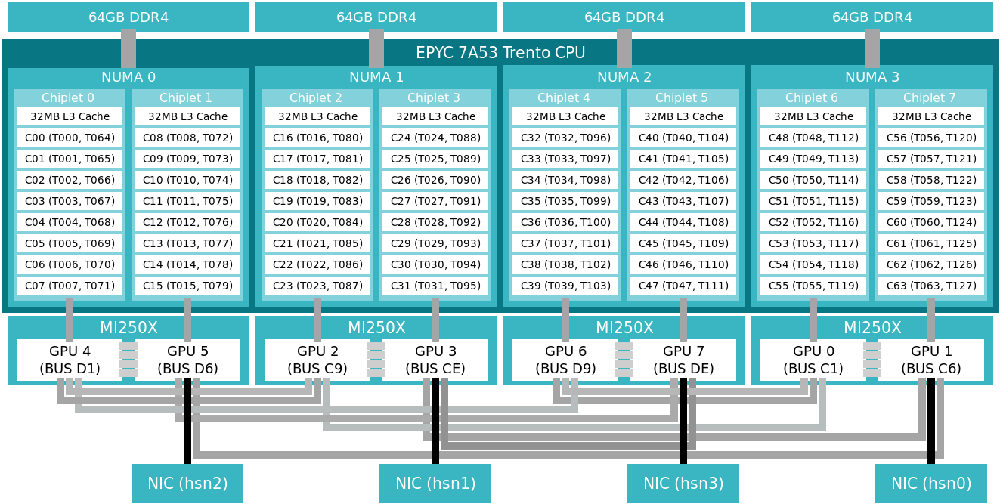

# Investigation of Setonix GPU access patterns

## Introduction
- A Setonix GPU node has a 64-core AMD Trento CPUs and 4 AMD MI250X GPUs. 
- Each MI250X contains 2 Graphics Complex Die (GCD)
- 64-cores on each GPU node is divided into 8-core groups called chiplets 
- The cores in a chiplet share an L3 cache, and each chiplet is physically connected to a specific GPU as shown here: 
- To reach the optimal performance, it is critical for each chiplet to use the GPU, which it's physically connected.
- To do this, two methods are introduced by Pawsey Supercomputing Centre's tutorial, and utilised here. 

## Codes
### Preliminary OLCF
- This code is a slightly modified version of the code used in [Setonix GPU compute node usage tutorial](https://support.pawsey.org.au/documentation/display/US/Example+Slurm+Batch+Scripts+for+Setonix+on+GPU+Compute+Nodes), and the original repository can be accessed [here](https://github.com/PawseySC/hello_jobstep). 
- The following modifications have been implemented:
    - ***printf***s are transformed into ***std::cout***s
    - ***CMake*** is utilised as the cross-compiler
- The steps in the example given in Pawsey Supercomputing Centre's [running GPU jobs on Setonix](https://support.pawsey.org.au/documentation/display/US/Example+Slurm+Batch+Scripts+for+Setonix+on+GPU+Compute+Nodes) is pursued for the modified code here.
    - The latest version of ROCM, ROCM 5.4.3, is used instead of the default one, along with CMake 3.21
    - ***PrgEnv-gnu*** should be used, since ***PrgEnv-cray*** is compatible with ***rocm/5.4.3***
    
### ASKAP - CLEAN


## Running exclusive jobs 
### 8 GPUs, each controled by 1 MPI task 
- 2 techniques explained above should be used
    - use a wrapper that selects the correct GPU
    - generate an ordered list to be used in the --cpu-bind option


- DEFINITION:
    - a ***slurm-socket***: an L3 cache group chiplet with 8 cores

```
salloc -N 1 -A accountName-gpu --partition=gpu-dev --exclusive --time=00:10:00

module load PrgEnv-gnu craype-accel-amd-gfx90a rocm/5.2.3 cmake/3.24.3
export PATH=$PATH:${CRAY_MPICH_DIR}/bin
export CPATH=$CPATH:${CRAY_MPICH_DIR}/include
export LD_LIBRARY_PATH=$LD_LIBRARY_PATH:${CRAY_MPICH_DIR}/lib/
export MPICH_GPU_SUPPORT_ENABLED=1

cmake ../
make

CPU_BIND=$(generate_CPU_BIND.sh mask_cpu)
echo $CPU_BIND

export OMP_NUM_THREADS=4
srun -N 1 -n 8 -c 8 --cpu-bind=${CPU_BIND} ../selectGPU_X.sh ./hello | sort -n
```

#### Result
- !!! There is a problem with OMP (This one is with OMP_PLACES=cores)
```
0: MPI 0 - OMP 0 - HWT 53 - Node nid002876 - RT_GPU_ID 0 - GPU_ID 0 - Bus_ID c1
0: MPI 0 - OMP 0 - HWT 53 - Node nid002876 - RT_GPU_ID 0 - GPU_ID 0 - Bus_ID c1
0: MPI 0 - OMP 0 - HWT 53 - Node nid002876 - RT_GPU_ID 0 - GPU_ID 0 - Bus_ID c1
0: MPI 0 - OMP 0 - HWT 53 - Node nid002876 - RT_GPU_ID 0 - GPU_ID 0 - Bus_ID c1
1: MPI 1 - OMP 0 - HWT 59 - Node nid002876 - RT_GPU_ID 0 - GPU_ID 1 - Bus_ID c6
1: MPI 1 - OMP 0 - HWT 59 - Node nid002876 - RT_GPU_ID 0 - GPU_ID 1 - Bus_ID c6
1: MPI 1 - OMP 0 - HWT 59 - Node nid002876 - RT_GPU_ID 0 - GPU_ID 1 - Bus_ID c6
1: MPI 1 - OMP 0 - HWT 59 - Node nid002876 - RT_GPU_ID 0 - GPU_ID 1 - Bus_ID c6
2: MPI 2 - OMP 0 - HWT 20 - Node nid002876 - RT_GPU_ID 0 - GPU_ID 2 - Bus_ID c9
2: MPI 2 - OMP 0 - HWT 20 - Node nid002876 - RT_GPU_ID 0 - GPU_ID 2 - Bus_ID c9
2: MPI 2 - OMP 0 - HWT 20 - Node nid002876 - RT_GPU_ID 0 - GPU_ID 2 - Bus_ID c9
2: MPI 2 - OMP 0 - HWT 20 - Node nid002876 - RT_GPU_ID 0 - GPU_ID 2 - Bus_ID c9
3: MPI 3 - OMP 0 - HWT 26 - Node nid002876 - RT_GPU_ID 0 - GPU_ID 3 - Bus_ID ce
3: MPI 3 - OMP 0 - HWT 26 - Node nid002876 - RT_GPU_ID 0 - GPU_ID 3 - Bus_ID ce
3: MPI 3 - OMP 0 - HWT 26 - Node nid002876 - RT_GPU_ID 0 - GPU_ID 3 - Bus_ID ce
3: MPI 3 - OMP 0 - HWT 26 - Node nid002876 - RT_GPU_ID 0 - GPU_ID 3 - Bus_ID ce
4: MPI 4 - OMP 0 - HWT 5 - Node nid002876 - RT_GPU_ID 0 - GPU_ID 4 - Bus_ID d1
4: MPI 4 - OMP 0 - HWT 5 - Node nid002876 - RT_GPU_ID 0 - GPU_ID 4 - Bus_ID d1
4: MPI 4 - OMP 0 - HWT 5 - Node nid002876 - RT_GPU_ID 0 - GPU_ID 4 - Bus_ID d1
4: MPI 4 - OMP 0 - HWT 5 - Node nid002876 - RT_GPU_ID 0 - GPU_ID 4 - Bus_ID d1
5: MPI 5 - OMP 0 - HWT 8 - Node nid002876 - RT_GPU_ID 0 - GPU_ID 5 - Bus_ID d6
5: MPI 5 - OMP 0 - HWT 8 - Node nid002876 - RT_GPU_ID 0 - GPU_ID 5 - Bus_ID d6
5: MPI 5 - OMP 0 - HWT 8 - Node nid002876 - RT_GPU_ID 0 - GPU_ID 5 - Bus_ID d6
5: MPI 5 - OMP 0 - HWT 8 - Node nid002876 - RT_GPU_ID 0 - GPU_ID 5 - Bus_ID d6
6: MPI 6 - OMP 0 - HWT 33 - Node nid002876 - RT_GPU_ID 0 - GPU_ID 6 - Bus_ID d9
6: MPI 6 - OMP 0 - HWT 33 - Node nid002876 - RT_GPU_ID 0 - GPU_ID 6 - Bus_ID d9
6: MPI 6 - OMP 0 - HWT 33 - Node nid002876 - RT_GPU_ID 0 - GPU_ID 6 - Bus_ID d9
6: MPI 6 - OMP 0 - HWT 33 - Node nid002876 - RT_GPU_ID 0 - GPU_ID 6 - Bus_ID d9
7: MPI 7 - OMP 0 - HWT 43 - Node nid002876 - RT_GPU_ID 0 - GPU_ID 7 - Bus_ID de
7: MPI 7 - OMP 0 - HWT 43 - Node nid002876 - RT_GPU_ID 0 - GPU_ID 7 - Bus_ID de
7: MPI 7 - OMP 0 - HWT 43 - Node nid002876 - RT_GPU_ID 0 - GPU_ID 7 - Bus_ID de
7: MPI 7 - OMP 0 - HWT 43 - Node nid002876 - RT_GPU_ID 0 - GPU_ID 7 - Bus_ID de
```

or:
```
srun -N 1 -n 8 -c 8 --gpu-bind=closest ./hello | sort -n
```

## TO DO LIST
- Set up a simple hello world program: Each node, each thread and GPU should say hello
- Use a single OpenMP thread
- Use multiple OpenMP threads
- Modify, compile & run the deconvolution benchmarking code


